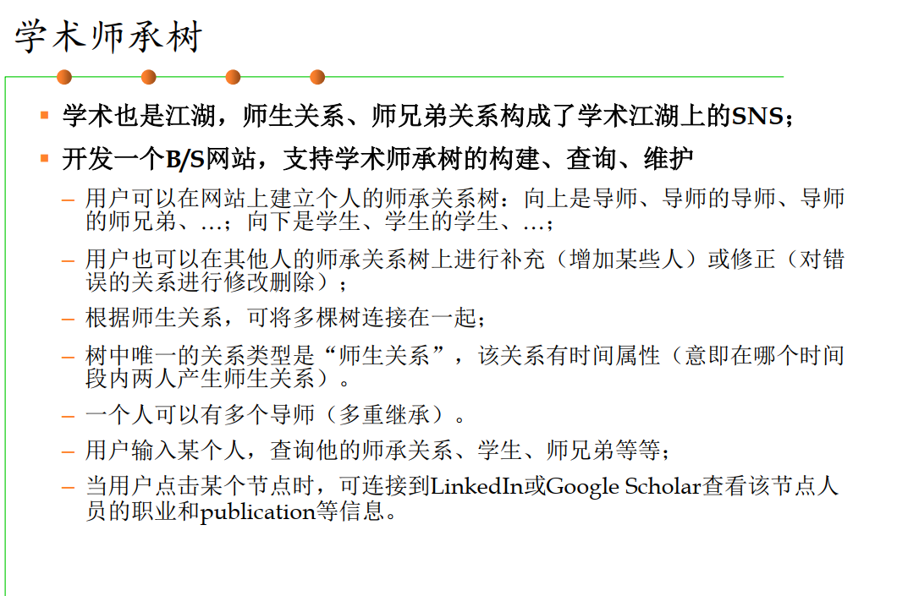

# 软件工程 Project 说明文档

这里只对项目进行笼统的介绍，具体如何设计和实现参考前端文档和后端文档

## Project 介绍

所选题目为**学术师承树**



## 架构设计

整体采用前后端分离的策略，前端采用 Vue 项目实现，后端使用 SpringBoot 项目实现，前后端通过设计好的 Api 进行通信，数据通过 HTTP 协议进行封装。用户通过浏览器访问网站获得提供的服务。

后端只负责处理请求和处理数据，渲染完全交给前端的 Vue 做

### 整体功能设计

#### 用户信息定义

用户信息由 UID，手机号，密码，邮箱，姓名，昵称，个人主页组成。其中 UID，手机号，昵称是全局唯一的。

在登录时，用户可以凭 UID 或手机号+密码进行登录，UID 和手机号用长度进行区分，UID 为 9 位，手机号为 11 位。UID 不由用户指定，而是随着注册自动生成。

在注册时，用户通过手机号进行注册，注册的手机号不能为已经注册账号的手机号。

#### 师承关系可视化

选用树结构进行可视化。在树中，每个结点代表一个用户；每条边表示一个师生关系，由老师指向学生；一条边可以承载两个人之间不同阶段的师生关系，即一条边可以承载其本科、硕士、博士阶段的师生关系但每个阶段只能有一对起止时间。

展示时，只展示其直接的老师和学生。

比如：现在有一条从张三指向李四的边，那么这条边可以表示张三为李四的本科、硕士、博士老师。但是如果这条边已经承载了张三为李四本科老师这一师生关系，就不可以再承载另一个张三为李四本科老师的师生关系，但是可以再承载张三为李四的硕士老师这一师生关系。

每个师生关系都是有时间属性的，用开始时间和结束时间标识，时间至精确到月。

点击用户对应的节点跳转到该用户设置的个人主页（如果设置了的话）。

#### 师承关系的修改操作

师承关系的修改操作根据修改操作的树的不同分为修改自己的树和修改他人的树，又根据修改操作的类型不同分为增加、删除、修改三种，其中增加和删除又分为添加或删除的是老师还是学生。

所有的修改操作都通过申请来实现，只有一个修改操作的相关用户都同意这次修改操作才真正修改对应的师承树。

- 对于自己树的修改
  - 申请直接提交到要修改的**结点**对应的用户那里
  - 用户同意申请则修改树
  - 拒绝则无事发生
- 对于他人树的修改
  - 申请提交到要修改的**树**对应的用户那里
  - 用户同意申请则将该申请转换为对自己树的修改操作的申请用对自己树的修改操作处理逻辑进行处理
  - 拒绝则无事发生

例子：

- 张三想要添加李四为自己的学生，那么这个申请就会由张三发出提交到李四那里，李四同意则张三和李四的树做对应修改，拒绝则无事发生
- 张三想要添加李四为王五的学生，那么这个申请就会由张三发出提交到王五那里
  - 王五同意则该申请转换为王五想要添加李四为自己的学生，由王五发出一个申请到李四那里
    - 李四同意则王五和李四的树做对应修改，拒绝则无事发生
  - 否则无事发生

#### 查询用户

查询用户可以通过 UID、手机号、姓名进行搜索，同时还可以搜索该用户的师承树。

查询师兄弟这里不直接做出来，而是先查询其老师，再查询其老师的师承树查看其师兄弟

## 前端设计

前端主要有两个界面，登录和注册以及主界面。前端开发时使用 element-plus 组件进行组合设计 UI。这里只说明前端的处理逻辑，UI 的设计和代码实现这里不提及，具体查看前端文档。

### 前端数据持久化

因为前端在每次请求时都要携带一个登录时后端返回的 JWT 令牌进行身份验证，因此将 JWT 存储下来是很有必要的，同时还可以把用户数据直接存储下来，避免重复请求，提高运行性能。

这里使用 pinia 和 pinia-persistedstate 来持久化数据。pinia-persistedstate 的作用是将数据从内存存储到本地，防止用户刷新页面数据丢失的问题。

### 后端请求 API 接口封装

具体的 API 封装这里不涉及，前端只用参考后端设计的接口文档进行请求获得数据即可，这里主要说明请求和响应的拦截器。

~~_前端只需要参考接口文档就行了，后端要考虑的事情就多了_~~

#### 请求拦截器

在实际应用中，在每次请求时都要携带一个 JWT 令牌进行身份验证，为了统一添加，这里使用一个请求拦截器在所有请求发出时，添加一个 Authorization 请求头，其值为本地存储中的 JWT 令牌。

#### 响应拦截器

统一处理后端响应失败的处理，这样前端只用处理正确响应的逻辑即可，而不需要考虑错误判断。当响应成功时返回后端响应携带的数据。

在响应失败这里，后端如果 JWT 校验不通过（即用户未登录就访问其他页面）则会返回状态码 401，拦截器中通过判断每次的响应状态码来判断当前用户是否登录，如果没有登录，则统一跳转到登录界面。

### 页面-登陆注册

登录和注册放在同一个页面中，通过一个按钮进行切换。

用户登录时使用 UID 或者手机号+密码进行登录，前端要对 UID 还是手机号进行判断，同时要判断用户是否使用 UID 或者手机号进行登录，这里直接使用正则表达式进行校验即可。同时根据后端的响应判断是否成功登录。

用户注册时使用手机号进行注册，设置密码时要用户进行二次输入验证。前端要对两次输入的密码是否相同做校验，同时对输入的手机号是否合法进行校验。

注册成功后自动显示登录界面，同时将用户的手机号和密码自动填充等待用户登录。

### 页面-主页面

主页面中会承载师承树展示和搜索、申请处理、用户个人设置三个子页面并通过一个导航栏进行切换，用户登陆时默认显示师承树展示和搜索界面。

#### 师承树展示和搜索

负责师承树的展示以及用户搜索功能，以及在其之上的师承树修改操作的处理

#### 申请处理

负责展示提交到当前用户的申请，同时负责对申请的处理逻辑（同意或拒绝）

#### 个人设置

负责用户个人信息的修改，包括：姓名，邮箱，密码，昵称，个人主页，头像

## 后端设计

后端采用 SpringBoot 框架，分为三层：Controller、Service、Mapper。

- Controller 层负责响应请求，解析请求数据，调用 Service 层服务进行处理，返回响应数据
- Service 层负责具体的业务逻辑，通过 Mapper 层获得数据，并进行处理，返回给 Controller 层
- Mapper 层负责在数据之上的操作，提供增删改查的功能

具体的实现查看后端文档

## 使用说明

### 前端项目

在运行前端项目之前，请确保已经安装了 Node.js 和 npm

[npm 下载](https://www.npmjs.com/)

从 front 分支获取项目代码

```shell
git clone -b front https://github.com/hit-fushibo/HITSoftWareProject.git
```

在前端项目根目录下运行 `npm install`以安装项目依赖

```shell
npm install
```

运行 `npm run dev`以启动前端项目

注意，项目默认在 5631 端口启动，如果想要在其他端口启动，请修改 Vue 项目配置文件

### 后端项目

在运行后端项目前，请确保 JDK 版本大于等于 JDK 17，否则无法运行。同时推荐使用 IDEA 打开项目。

[JDK 下载](https://www.oracle.com/java/technologies/java-se-glance.html)

[IDEA 下载](https://www.jetbrains.com/idea/)

从 backend 分支获取项目代码

```shell
git clone -b backend https://github.com/hit-fushibo/HITSoftWareProject.git
```

使用 IDEA 的 meaven 管理安装依赖

使用 IDEA 运行项目

如果你想在其他环境中运行，推荐先使用 IDEA 将项目打包成 jar 文件之后运行

```shell
java -jar your_jar.jar
```

注意，后端项目默认在 9090 端口启动。如果想要在其他端口启动，请修改 SpringBoot 项目配置，同时前端项目中的请求发送地址也需要修改。

## 注意事项

Vue 在启动时如果设置的端口被占用会自动向后寻找可用端口并在这个端口启动服务。

同时在 Linux 命令行下使用 `npm run dev &`无法使 Vue 项目正常在后台运行（这里也有可能是我把输出重定向到文件的原因，但是 Vue 项目运行时貌似会新开一个终端，具体原因我也没搞懂，但是使用 tmux 在**前台**运行之后使用键盘快捷键断开和 tmux 的连接确实可以保证 Vue 项目还在运行），Vue 项目运行一段时间后就会 Stop 并且不会释放其占用的端口导致不可预知的错误。

如果需要在后台运行，推荐使用 tmux。
