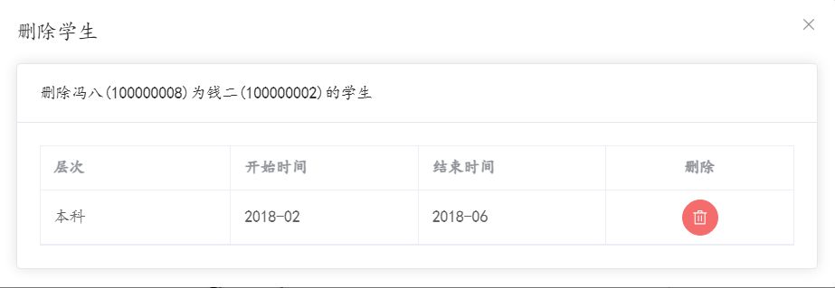

# 软件工程Project前端文档

这份文档介绍软件工程Project的前端UI设计、渲染逻辑以及前端用户事务的处理逻辑，以及前端如何持久化数据，拦截器如何设置，前端路由如何实现。

前端使用Vue项目实现，请确保在阅读这份文档之前至少知道Vue是干啥的以及稍微了解Vue项目结构。

建议从头开始读，因为后边有几个实在不想写了/(ㄒoㄒ)/~~。

一般来说你把3.4 那弄明白了其他组件也就明白了，3.4也是我写它花时间最长的一个组件。

---

写这份文档时我的精神状态越写越颠，做好心理准备

## 1.Pinia持久化数据

这一部分的实现在 `/src/token.js`

在这份js文件中，定义了两个Store，分别存储JWT令牌以及用户信息。

存储JWT令牌的Store，只存储JWT令牌，在登录时获取，后续在请求拦截器中封装Authorization请求头时直接从这个Store获取。

```js
export const usrTokenStore = defineStore("token", () => {
    //1.定义描述token
    const token = ref("");
    //2.定义修改token的方法
    const setToken = (newToken) => {
        token.value = newToken;
    };
    //3.定义移除token的方法
    const removeToken = () => {
        token.value = "";
    };
    return {
        token,
        setToken,
        removeToken,
    };
},
{
    persist:true
}
);
```

存储用户信息的Store，存储用户UID，手机号，邮箱，姓名，昵称，头像地址，个人主页。这些在第一次加载主界面时获取，后续需要用到这些用户信息的地方直接从这个Store中获取。

```js
export const usrInfoStore = defineStore("usrInfo", () => {
    //1.定义描述token
    const usrInfo = ref({
        uid:"",
        phone:"",
        email:"",
        name:"",
        nickname:"",
        usrPic:"",
        myPage:""
    })
    //2.定义修改token的方法
    const setUsrInfo = (newUsrInfo) => {
        usrInfo.value = newUsrInfo;
    };
    //3.定义移除token的方法
    const removeUsrInfo = () => {
        token.value = "";
    };
    return {
        usrInfo,
        setUsrInfo,
        removeUsrInfo,
    };
},
{
    persist:true
}
);
```

在定义时都添加了

```js
{
    persist:true
}
```

来启用pinia-persistedstate将数据存储到本地。

在用户退出登录时销毁清空存储。

## 2.请求和响应拦截器

这一部分实现在 `src/util/requests.js`

首先创建一个axios请求器

```js
const baseURL = "/api"
const instance = axios.create({ baseURL })
```

`baseURL`设置为 `/api`是因为前端设置跨域请求的代理的原因，具体在跨域请求处理部分实现

请求拦截器主要是为了统一给请求加上JWT令牌以通过后端身份验证。实现如下：

```js
//请求拦截器

instance.interceptors.request.use(
    (config) => {
        //在发送请求之前做什么
        let tokenStore = usrTokenStore()
        //如果token中有值，在携带
        if (tokenStore.token) {
            config.headers.Authorization = tokenStore.token
        }
        return config
    },
    (err) => {
        //如果请求错误做什么
        Promise.reject(err)
    }
)
```

响应拦截器是为了统一处理不成功的响应。不成功的响应有两种类型，一种是状态码不为200的，一种是状态码为200但是响应数据中的code不为0。对于状态码不为200的响应，首先判断是否为未通过JWT身份验证，即响应码为401，这种情况直接跳转到登录界面。如果是其他的状态码，统一提示 `服务异常`。对于另一种不成功的响应，直接提示其响应数据中的message字段。如果是成功的响应，则返回响应中的数据。实现如下：

```js
//响应拦截器
instance.interceptors.response.use(
    result => {
        //如果业务状态码为0，代表本次操作成功
        if (result.data.code == 0) {
            return result.data;
        }//代码走到这里，代表业务状态码不是0，本次操作失败
        ElMessage.error(result.data.message || '服务异常');
        return Promise.reject(result.data);//异步的状态转化成失败的状态
    },
    err => {
        console.log(err)
        //如果响应状态码时401，代表未登录，给出对应的提示，并跳转到登录页
        if (err.response.status === 401) {
            ElMessage.error('请先登录！ ')
            router.push('/login')
        } else {
            ElMessage.error('服务异常');
        }
        return Promise.reject(err);//异步的状态转化成失败的状态
    }
)
```

之后通过 `export default instance;`对外暴露加了拦截器的axios请求器。

## 3.页面设计

前端主要分为两个页面，登录注册和主界面。在项目说明文档中也提及了这两个页面的作用，下面详细介绍这两个页面的设计和处理逻辑

### 3.1登录注册页面

#### 3.1.1UI设计

登录


注册


两个界面的切换通过 `注册`和 `返回`切换。

#### 3.1.2渲染逻辑

页面html文档

```html
<div>
    <el-row class="login-page">
        <el-col :span="12" class="bg"></el-col>
        <el-col :span="6" :offset="3" class="form">
            <!-- 注册表单 -->
            <el-form ref="from" size="large" autocomplete="off" v-if="isRegister">
                <el-form-item>
                    <h1>注册</h1>
                </el-form-item>
                <el-form-item>
                    <el-input :prefix-icon="User" v-model="singUp_phone" placeholder="请输入手机号"></el-input>
                </el-form-item>
                <el-form-item>
                    <el-input :prefix-icon="Lock" v-model="singUp_pwd" placeholder="请输入密码"></el-input>
                </el-form-item>
                <el-form-item>
                    <el-input :prefix-icon="Lock" v-model="singUp_pwd_confirm" placeholder="请再次输入密码"></el-input>
                </el-form-item>
                <el-form-item>
                    <el-button class="button" type="primary" auto-insert-space @click="singUp">
                        注册
                    </el-button>
                </el-form-item>
                <el-form-item>
                    <el-link type="info" :underline="true" @click="isRegister = false">
                        返回
                    </el-link>
                </el-form-item>
            </el-form>

            <!-- 登录表单 -->
            <el-form ref="from" size="large" autocomplete="off" v-if="!isRegister">
                <el-form-item>
                    <h1>登录</h1>
                </el-form-item>
                <el-form-item>
                    <el-input :prefix-icon="User" v-model="login_id" placeholder="请输入uid/手机号"></el-input>
                </el-form-item>
                <el-form-item>
                    <el-input :prefix-icon="Lock" v-model="login_pwd" placeholder="请输入密码"></el-input>
                </el-form-item>
                <el-form-item>
                    <el-button class="button" type="primary" auto-insert-space @click="login">
                        登录
                    </el-button>
                </el-form-item>
                <el-form-item>
                    <el-link type="info" :underline="true" @click="isRegister = true">
                        注册
                    </el-link>
                </el-form-item>
            </el-form>
        </el-col>
    </el-row>
</div>
```

整个页面为一个box容器，其中使用一个el-row组件来管理左侧的背景图片和右侧的登录以及注册表单。使用一个布尔变量 `isRegister`来控制显示的是注册表单还是登录表单。

登录表单使用 `login_id`、`login_pwd`和两个输入框进行绑定，注册表单使用 `singUp_phone`、`singUp_pwd`、`singUp_pwd_confirm`来绑定注册表单的输入框。

登录表单的注册按钮的回调函数是设置 `isRegister`为 `true`，登录按钮回调函数绑定登录处理函数 `login`。

注册表单的返回按钮的回调函数是设置 `isRegister`为 `false`，注册按钮回调函数绑定注册处理函数 `signUp`。

#### 3.1.3事件处理逻辑

这里只有两个事件要处理，分别为登录和注册。

登录事件处理逻辑

1. 首先从绑定的数据中获取输入
2. 校验数据并判断是UID登录还是手机号登录
3. 填充请求数据
4. 调用请求API完成请求
5. 成功登录则存储JWT令牌并使用路由跳转到主界面，否则提示错误信息

```js
const login = async () => {
    let id = login_id.value
    let pwd = login_pwd.value
    let pori = 0
    if (id.length === 11) {
        pori = 0
    }
    else if (id.length === 9) {
        pori = 1
    }
    else {
        ElMessage.error("登录id只能为9位uid或11位手机号")
        return
    }
    if (pwd.length === 0) {
        ElMessage.error("请输入密码")
        return
    }
    let loginData = {
        id: id,
        password: pwd,
        pori: pori
    }
    let response = await userLoginService(loginData)
    if (response.code !== 0) {
        ElMessage.error(response.message);
    }
    else {
        //借助路由完成跳转
        tokenStore.setToken(response.data);
        ElMessage.success("登录成功")
        router.push('/')
    }

}
```

注册事件处理逻辑

1. 从绑定的数据中获取输入
2. 对数据进行校验
3. 封装注册请求数据
4. 调用请求API向后端发送注册请求
5. 返回成功响应则填充登录表单并显示登录界面等待用户登录

```js
const singUp = async () => {
    //获得数据
    let phone = singUp_phone.value
    let pwd = singUp_pwd.value
    let pwd_confirm = singUp_pwd_confirm.value
    //数据校验
    const phonePattern = /^\d{11}$/;
    if (!phonePattern.test(phone)) {
        ElMessage.error("手机号必须为11位数字")
        return
    }
    if (pwd !== pwd_confirm) {
        ElMessage.error("两次密码需要相同")
        return
    }
    //请求数据封装
    let registerData = {
        userPhone: phone,
        password: pwd
    }
    //向后端发送注册请求
    let response = await userRegisterService(registerData)
    //处理后端响应
    if (response.code !== 0) {
        //重复手机号
        ElMessage.error(response.message);
    }
    else {
        //成功注册
        ElMessage.success("注册成功")
        login_id.value = phone
        login_pwd.value = pwd
        isRegister.value = false
    }
}
```

### 3.2主界面

#### 3.2.1UI设计

初始界面


下拉菜单展开


导航菜单展开


#### 3.2.2渲染逻辑

页面html文档

```html
<el-container class="layout-container">
    <!-- 左侧菜单 -->
    <el-aside width="200px">
        <div class="el-aside__logo"></div>
        <el-menu default-active="1" active-text-color="#ffd04b" router>
            <el-menu-item index="/treeAndProcess/tree">
                <el-icon>
                    <StarFilled />
                </el-icon>
                <span>师承树</span>
            </el-menu-item>
            <el-menu-item index="/treeAndProcess/requestProcess">
                <el-icon>
                    <User />
                </el-icon>
                <span>申请处理</span>
            </el-menu-item>
            <el-sub-menu>
                <template #title>
                    <el-icon>
                        <Setting />
                    </el-icon>
                    <span>个人设置</span>
                </template>
                <el-menu-item index="/user/setting">
                    <el-icon>
                        <User />
                    </el-icon>
                    <span>基本资料</span>
                </el-menu-item>
                <el-menu-item index="/user/avatarUpload">
                    <el-icon>
                        <Crop />
                    </el-icon>
                    <span>更换头像</span>
                </el-menu-item>
                <el-menu-item index="/user/password">
                    <el-icon>
                        <EditPen />
                    </el-icon>
                    <span>修改密码</span>
                </el-menu-item>
            </el-sub-menu>
        </el-menu>
    </el-aside>
    <!-- 右侧主区域 -->
    <el-container>
        <!-- 头部区域 -->
        <el-header>
            <div>您好： <strong>{{ usrInfo.name }}</strong></div>
            <el-dropdown placement="bottom-end" @command="handleCommand">
                <span class="el-dropdown__box">
                    <el-avatar v-if="usrInfo.usrPic===''">{{ usrInfo.name }}</el-avatar>
                    <el-avatar v-else :src="imgUrl" />
                    <el-icon>
                        <CaretBottom />
                    </el-icon>
                </span>
                <template #dropdown>
                    <el-dropdown-menu>
                        <el-dropdown-item command="setting" :icon="User">基本资料</el-dropdown-item>
                        <el-dropdown-item command="avatarUpload" :icon="Crop">更换头像</el-dropdown-item>
                        <el-dropdown-item command="password" :icon="EditPen">重置密码</el-dropdown-item>
                        <el-dropdown-item command="logout" :icon="SwitchButton">退出登录</el-dropdown-item>
                    </el-dropdown-menu>
                </template>
            </el-dropdown>
        </el-header>
        <!-- 中间区域 -->
        <el-main>
            <router-view></router-view>
        </el-main><!-- 底部区域 -->
        <el-footer>师承树 ©2024 Created by HIT</el-footer>
    </el-container>
</el-container>
```

整个主页面为一个容器，采用element的container布局容器，采用的布局形式如下：


在Aside部分

* 最上边显示logo，这里直接显示Vue的loge了
* 下面是一个menu，通过设置其的router属性，启用其路由功能，点击条目时跳转到其index属性对应的页面，由于index属性设置为相对路径，所以这里其实是一个子路由，这部分在前端路由部分进行讲解

Header部分

* 显示一个欢迎标语，根据登录用户不同显示不同的用户名，渲染响应式数据实现
* 右侧是一个下拉菜单，图标为用户头像
  * 下拉菜单中显示了Aside部分的menu中的个人设置中的内容功能和menu相同，都是点击显示对应界面，还有一个退出登录的选项用于用户退出登录

#### 3.2.3事件处理逻辑

在主界面加载时，需要获取用户信息并存储在pinia中

```js
const infoStore = usrInfoStore()
const tokenStore = usrTokenStore();

const getUsrInfo = async () => {
    let response = await getUserInfoService();
    usrInfo.value = response.data
    //使用pinia持久化用户数据
    infoStore.setUsrInfo(usrInfo.value)
    console.log(usrInfo.value)
}
```

这个原本是需要挂载到onMount中，但是Vue3使用组件式api风格可以直接在js部分调用

```js
//获取个人信息
getUsrInfo()
```

用户点击导航菜单的事件直接通过element-plus提供的属性进行操作。

下拉菜单的导航功能则是通过设置下拉菜单command对应的回调函数并在每个下拉项中设置对应的command实现

```html
<el-dropdown placement="bottom-end" @command="handleCommand">
    <span class="el-dropdown__box">
        <el-avatar v-if="usrInfo.usrPic===''">{{ usrInfo.name }}</el-avatar>
        <el-avatar v-else :src="imgUrl" />
        <el-icon>
            <CaretBottom />
        </el-icon>
    </span>
    <template #dropdown>
        <el-dropdown-menu>
            <el-dropdown-item command="setting" :icon="User">基本资料</el-dropdown-item>
            <el-dropdown-item command="avatarUpload" :icon="Crop">更换头像</el-dropdown-item>
            <el-dropdown-item command="password" :icon="EditPen">重置密码</el-dropdown-item>
            <el-dropdown-item command="logout" :icon="SwitchButton">退出登录</el-dropdown-item>
        </el-dropdown-menu>
    </template>
</el-dropdown>
```

在回调函数中判断用户是否点击的退出登录。如果是退出登录则弹出一个确认框等待用户二次确认，当用户确认退出登录后，清空pinia本地存储并跳转到登录界面。否则跳转到对应界面。

```js
const handleCommand = (command) => {
    if (command === 'logout') {
        //退出登录
        ElMessageBox.confirm(
            '你确认退出登录码？ ',
            '温馨提示',
            {
                confirmButtonText: '确认',
                cancelButtonText: '取消',
                type: 'warning',
            }
        ).then(async () => {
            //用户点击了确认
            //清空pinia中的token和个人信息
            infoStore.info = {}
            tokenStore.token = ''
            //跳转到登录页
            router.push('/login')
        }).catch(() => {
            //用户点击了取消
            ElMessage({
                type: 'info',
                message: '取消退出',
            })
        })
    } else {
        //路由
        router.push('/user/' + command)
    }
}

```

### 3.4师承树展示和搜索界面

#### 3.4.1UI设计

初始展示


右键节点弹出菜单


* 点击修改弹出的修改弹窗
* 
  * 点击修改弹窗修改按钮弹出的弹窗
  * 
* 点击删除弹出的弹窗
* 

搜索结果展示


* 选中一个搜索结果后点击添加按钮弹出的弹窗，这里添加学生和添加老师的长得一样只是渲染的标题不同，只展示一个
* 
  * 层次下拉菜单
  * 
  * 时间选择
  * 
* 双击搜索结果展示对应人的师承树
* 

#### 3.4.2渲染逻辑

界面html文档

```html
    <!-- 添加弹窗 -->
    <el-dialog v-model="addTableVisible" aligin-cnter :title="addTitle">
        <el-card>
            <template #header>
                <span v-if="addType === 1">添加{{ addName }}({{ addUid }})为{{ addToName }}({{ addToUid }})的学生</span>
                <span v-else>添加{{ addName }}({{ addUid }})为{{ addToName }}({{ addToUid }})的老师</span>
            </template>
            <el-form :model="addFrom">
                <el-form-item label="师生关系层次">
                    <el-select v-model="addFrom.level" clearable>
                        <el-option v-for="item in addOptions" :key="item.value" :label="item.label"
                            :value="item.value" />
                    </el-select>

                </el-form-item>
                <el-form-item label="师生关系开始时间">
                    <el-date-picker v-model="addFrom.startTime" type="month" format="YYYYMM"
                        @change="handleStartDateChange">

                    </el-date-picker>
                </el-form-item>
                <el-form-item label="师生关系结束时间">
                    <el-date-picker v-model="addFrom.endTime" type="month" format="YYYYMM"
                        @change="handleEndDateChange">

                    </el-date-picker>
                </el-form-item>
            </el-form>
            <el-button @click="add">添加</el-button>
        </el-card>

    </el-dialog>

    <!-- 编辑弹窗 -->
    <el-dialog v-model="modifyTableVisible" aligin-cnter title="编辑">
        <el-card>
            <template #header>
                <span>修改{{ modifyName }}({{ modifyUid }})与{{ modifyToName }}({{ modifyToUid }})的师生关系</span>
            </template>
            <el-table :data="modifyRel" stripe border style="width:100%">
                <el-table-column label="层次">
                    <template #default="scope">
                        <span v-if="scope.row.level === '0'">本科</span>
                        <span v-else-if="scope.row.level === '1'">硕士</span>
                        <span v-else>博士</span>
                    </template>
                </el-table-column>
                <el-table-column prop="startTime" label="开始时间" />
                <el-table-column prop="endTime" label="结束时间" />
                <el-table-column label="修改" align="center" #default="scope">
                    <el-button type="primary" :icon="Edit" circle @click="editOnClicked(scope.row.level)" />
                    <!-- @click="processButtonClick(scope.row.level)" -->
                </el-table-column>
            </el-table>
        </el-card>
    </el-dialog>

    <el-dialog v-model="inModifyTableVisible" aligin-center draggable title="修改起始时间">
        <el-form :model="modifyFrom">
            <el-form-item label="师生关系开始时间">
                <el-date-picker v-model="modifyFrom.startTime" type="month" format="YYYYMM"
                    @change="handleStartDateChangeM">

                </el-date-picker>
            </el-form-item>
            <el-form-item label="师生关系结束时间">
                <el-date-picker v-model="modifyFrom.endTime" type="month" format="YYYYMM"
                    @change="handleEndDateChangeM">

                </el-date-picker>
            </el-form-item>
        </el-form>
        <el-button @click="modify">修改</el-button>
    </el-dialog>

    <!-- 删除弹窗 -->
    <el-dialog v-model="delTableVisible" aligin-cnter :title="delTitle">
        <el-card>
            <template #header>
                <span v-if="delType === 1">删除{{ delName }}({{ delUid }})为{{ delToName }}({{ delToUid }})的学生</span>
                <span v-else>删除{{ delName }}({{ delUid }})为{{ delToName }}({{ delToUid }})的老师</span>
            </template>
            <el-table :data="modifyRel" stripe border style="width:100%">
                <el-table-column label="层次">
                    <template #default="scope">
                        <span v-if="scope.row.level === '0'">本科</span>
                        <span v-else-if="scope.row.level === '1'">硕士</span>
                        <span v-else>博士</span>
                    </template>
                </el-table-column>
                <el-table-column prop="startTime" label="开始时间" />
                <el-table-column prop="endTime" label="结束时间" />
                <el-table-column label="删除" align="center" #default="scope">
                    <el-button type="danger" :icon="Delete" circle @click="deleteOnClicked(scope.row.level)" />
                </el-table-column>
            </el-table>
        </el-card>
    </el-dialog>


    <!-- 右键菜单项 -->
    <div class="context-menu" style="display: none; position: absolute;">
        <div class="context-menu-item" @click="modifyOnClicked">修改</div>
        <div class="context-menu-item" @click="delOnClicked">删除</div>
    </div>

    <div id="TreeAndSearch">
        <div id="tree">

        </div>
        <div id="search">
            <div class="button-container">
                <el-input v-model="searchKeyword" placeholder="UID/手机号/姓名"></el-input>
                <el-button @click="search">搜索</el-button>
            </div>
            <div id="searchResult" class="search-result">
                <el-card v-for="(result, index) in results" :key="result.uid" class="result_box"
                    @click="selectResult(index + 1)" @dblclick="showTree(index + 1)">
                    <div slot="header" class="avatar">
                        <!--  -->
                        
                        
                    </div>
                    <div class="info">
                        <div class="top-info">
                            <p>姓名：{{ result.name }}</p>
                            <p>UID：{{ result.uid }}</p>
                        </div>
                        <div class="bottom-info">
                            <p>邮箱：{{ result.email }}</p>
                        </div>
                    </div>
                </el-card>
            </div>
            <div class="button-container">
                <el-button class="add-student" @click="addStudentOnClick">添加为学生</el-button>
                <el-button class="add-teacher" @click="addTeachertOnClick">添加为老师</el-button>
            </div>
        </div>
    </div>
```

##### 师承树渲染

师承树渲染采用d3这一数据可视化库。

师承树的渲染通过函数调用实现，调用 `drawChart()`函数即可完成师承树的渲染，下面讲解该函数如何实现师承树的渲染。

师承树渲染中有三个array用于存储后端返回的数据，其的设置在树的获取函数中，这里只是用到其中的值

```js
let me = [];
let teachers = [];
let students = [];
```

在渲染之前，根据这三个array创建树的结点和边

```js
    nodes = me.concat(teachers, students)
    let teacherLinks = teachers.map(teacher => {
        return { source: teacher.name, target: me[0].name };
    });
    let studentLinks = students.map(student => {
        return { source: me[0].name, target: student.name }
    });

    links = teacherLinks.concat(studentLinks);
```

之后清除用于存放师承树的容器中的所有元素

```js
    const container = document.getElementById('tree'); // 获取容器元素
    container.innerHTML = ''; // 清空容器中的所有子元素
```

接下来在这个容器中创建一个宽和高与容器相同的SVG元素，并在其中放一个力导向布局

```js
    // 获取容器的宽度和高度
    const containerWidth = document.getElementById('tree').clientWidth;
    const containerHeight = document.getElementById('tree').clientHeight;

    const svg = d3.select('#tree')
        .append('svg')
        .attr('width', containerWidth)
        .attr('height', containerHeight);
    // 添加箭头标记的声明
    svg.append('defs')
        .append('marker')
        .attr('id', 'arrow')
        .attr('markerWidth', 8)
        .attr('markerHeight', 8)
        .attr('refX', 8)
        .attr('refY', 3)
        .attr('orient', 'auto')
        .attr('markerUnits', 'strokeWidth')
        .append('path')
        .attr('d', 'M0,0 L0,6 L9,3 z')
        .attr('fill', 'black');


    // 创建一个力导向图布局，设置范围为容器的宽度和高度


    const simulation = d3.forceSimulation(nodes)
        .force('link', d3.forceLink(links).id(d => d.name))
        .force('charge', d3.forceManyBody().strength(-500 * r))
        .force('center', d3.forceCenter(containerWidth / 2, containerHeight / 2));
```

之后创建连接线，终结处使用一个箭头来渲染成有向边

```js
// 创建连接线
    const link = svg.selectAll('.link')
        .data(links)
        .enter()
        .append('line')
        .attr('class', 'link')
        .attr('stroke', 'black')
        .attr('stroke-width', 2)
        .attr('marker-end', 'url(#arrow)'); // 使用箭头标记
```

之后创建节点，在节点处还设置了双击和右键事件回调，这一部分放在事件处理逻辑中讲。需要注意的是，在创建节点时，每个节点在js中都是一个object，其每个字段值都被存放到节点的对应字段中。

```js
// 创建节点
    const node = svg.selectAll('.node')
        .data(nodes)
        .enter()
        .append('circle')
        .attr('class', 'node')
        .attr('r', r)
        .attr('fill', d => { if (d.type == 0) return 'white'; else if (d.type == 1) return 'red'; else return 'blue'; }) // 设置节点填充色为空
        .attr('opacity', 0.5)
        .attr('stroke', 'black') // 设置节点边框颜色为黑色
        .attr('stroke-width', 2) // 设置节点边框宽度为2
```

之后创建文字显示节点名称

```js
//添加文字
    const texts = svg.selectAll("text")
        .data(nodes)
        .enter()
        .append("text")
        .style("fill", "black")
        .attr("dx", 0)
        .attr("dy", 0)
        .text(d => d.name);
```

之后设置力导向布局的更新函数

```js
// 更新连接线的位置
    simulation.on('tick', () => {

        link
            .attr('x1', d => cul(d.source.x, d.source.y, r, d.target.x, d.target.y, r)[0])
            .attr('y1', d => cul(d.source.x, d.source.y, r, d.target.x, d.target.y, r)[1])
            .attr('x2', d => cul(d.source.x, d.source.y, r, d.target.x, d.target.y, r)[2])
            .attr('y2', d => cul(d.source.x, d.source.y, r, d.target.x, d.target.y, r)[3]);
        node
            .attr('cx', d => d.x)
            .attr('cy', d => d.y);
        texts.attr("x", d => d.x - 10).attr("y", d => d.y + 10);
    });
```

最后设置鼠标拖拽功能，通过节点监听鼠标推拽事件并通过回调函数更新节点和连线和文字的位置

```js
// 添加鼠标点击和拖拽功能
    node.call(d3.drag()
        .on('start', (event, d) => {
            if (!event.active) simulation.alphaTarget(0.3).restart();
            d.fx = d.x;
            d.fy = d.y;
        })
        .on('drag', (event, d) => {
            d.fx = event.x;
            d.fy = event.y;
        })
        .on('end', (event, d) => {
            if (!event.active) simulation.alphaTarget(0);
            d.fx = null;
            d.fy = null;
        })
    );
```

这样一来就完成了师承树的渲染，当需要渲染其他的师承树时，需要先更新最开始定义的三个array的值，之后再调用该函数即可完成师承树的渲染。

##### 搜索结果渲染

从后端返回的搜索结果存放在一个响应式数据 `results`中

```js
let results = ref([]);
```

每一个搜索结果都是一个el-card，使用v-for指令动态从results中渲染每个搜索结果并设置单双击回调

```html
            <div id="searchResult" class="search-result">
                <el-card v-for="(result, index) in results" :key="result.uid" class="result_box"
                    @click="selectResult(index + 1)" @dblclick="showTree(index + 1)">
                    <div slot="header" class="avatar">
                        <!--  -->
                        
                        
                    </div>
                    <div class="info">
                        <div class="top-info">
                            <p>姓名：{{ result.name }}</p>
                            <p>UID：{{ result.uid }}</p>
                        </div>
                        <div class="bottom-info">
                            <p>邮箱：{{ result.email }}</p>
                        </div>
                    </div>
                </el-card>
            </div>
```

##### 添加弹窗渲染

这是渲染添加弹窗所需要的数据，其中 `addType`、`addName`、`addUid`、`addToUid`、`addToName`在单击添加按钮时获取。

```js
//添加弹窗及添加逻辑所需知道的内容
let addType = ref(0);//1-添加学生2-添加老师
let addName = ref("");//添加的姓名
let addUid = ref("");//添加的uid
let addToUid = ref("");//被添加的人的Uid
let addToName = ref("");//被添加人的姓名
let addTableVisible = ref(false);//添加弹窗可视化控制

//添加弹窗中的From数据
const addFrom = reactive({
    level: '',
    startTime: '',
    endTime: ''
})

//添加弹窗中的层次下拉菜单项
const addOptions = [
    {
        value: '0',
        label: '本科',
    },
    {
        value: '1',
        label: '硕士',
    },
    {
        value: '2',
        label: '博士',
    }
]

//日期选择器的回调函数，用于格式化日期
const handleStartDateChange = (value) => {
    if (value) {
        // 将日期转换为指定格式 YYYYMM
        const formattedDate = value.getFullYear() + '' + (value.getMonth() + 1).toString().padStart(2, '0');
        addFrom.startTime = formattedDate;
    } else {
        addFrom.startTime = '';
    }
}

const handleEndDateChange = (value) => {
    if (value) {
        // 将日期转换为指定格式 YYYYMM
        const formattedDate = value.getFullYear() + '' + (value.getMonth() + 1).toString().padStart(2, '0');
        addFrom.endTime = formattedDate;
    } else {
        addFrom.endTime = '';
    }
}

//计算属性，用于渲染添加弹窗标题
const addTitle = computed(() => {
    if (addType.value === 1) {
        return "添加学生"
    }
    else if (addType.value === 2) {
        return "添加老师"
    }
    else {
        return "未初始化"
    }
})
```

这是添加弹窗的html

```html
    <!-- 添加弹窗 -->
    <el-dialog v-model="addTableVisible" aligin-cnter :title="addTitle">
        <el-card>
            <template #header>
                <span v-if="addType === 1">添加{{ addName }}({{ addUid }})为{{ addToName }}({{ addToUid }})的学生</span>
                <span v-else>添加{{ addName }}({{ addUid }})为{{ addToName }}({{ addToUid }})的老师</span>
            </template>
            <el-form :model="addFrom">
                <el-form-item label="师生关系层次">
                    <el-select v-model="addFrom.level" clearable>
                        <el-option v-for="item in addOptions" :key="item.value" :label="item.label"
                            :value="item.value" />
                    </el-select>

                </el-form-item>
                <el-form-item label="师生关系开始时间">
                    <el-date-picker v-model="addFrom.startTime" type="month" format="YYYYMM"
                        @change="handleStartDateChange">

                    </el-date-picker>
                </el-form-item>
                <el-form-item label="师生关系结束时间">
                    <el-date-picker v-model="addFrom.endTime" type="month" format="YYYYMM"
                        @change="handleEndDateChange">

                    </el-date-picker>
                </el-form-item>
            </el-form>
            <el-button @click="add">添加</el-button>
        </el-card>

    </el-dialog>
```

该弹窗的展示通过布尔变量 `addTableVisible`控制。

首先根据计算属性 `addTitle`渲染添加弹窗的标题，`addTitle`根据 `addType`的不同决定渲染 `添加老师`还是 `添加学生`。

弹窗的内容为一个 `crad`组件，其中的 `titile`根据 `addType`的不同决定渲染那种标题，其中的内容为一个 `From`，绑定 `addFrom`数据，再这个表格中有三项：一个用于选择添加的层次的下拉菜单，通过addOptions渲染；两个日期选择器用于起始时间的选择，同时绑定 `change`事件的回调格式化数据。

`card`的最下面还有一个添加按钮。

##### 删除弹窗渲染

这是删除弹窗渲染所需数据，其中的 `delType`、`delName`、`delUid`、`delToUid`、`delToName`在师承树节点的右键事件回调中设置

```js
// 删除弹窗及删除操作所需内容
let delType = ref(0);//1-删除学生2-删除老师
let delName = ref("");//删除的姓名
let delUid = ref("");//删除的uid
let delToUid = ref("");//被删除的人的Uid
let delToName = ref("");//被删除人的姓名
let delTableVisible = ref(false);//删除弹窗可视化控制

//计算属性，用于渲染删除弹窗标题
const delTitle = computed(() => {
    if (delType.value === 1) {
        return "删除学生"
    }
    else if (delType.value === 2) {
        return "删除老师"
    }
    else {
        return "未初始化"
    }
})
```

这是删除弹窗的html

```html
    <!-- 删除弹窗 -->
    <el-dialog v-model="delTableVisible" aligin-cnter :title="delTitle">
        <el-card>
            <template #header>
                <span v-if="delType === 1">删除{{ delName }}({{ delUid }})为{{ delToName }}({{ delToUid }})的学生</span>
                <span v-else>删除{{ delName }}({{ delUid }})为{{ delToName }}({{ delToUid }})的老师</span>
            </template>
            <el-table :data="modifyRel" stripe border style="width:100%">
                <el-table-column label="层次">
                    <template #default="scope">
                        <span v-if="scope.row.level === '0'">本科</span>
                        <span v-else-if="scope.row.level === '1'">硕士</span>
                        <span v-else>博士</span>
                    </template>
                </el-table-column>
                <el-table-column prop="startTime" label="开始时间" />
                <el-table-column prop="endTime" label="结束时间" />
                <el-table-column label="删除" align="center" #default="scope">
                    <el-button type="danger" :icon="Delete" circle @click="deleteOnClicked(scope.row.level)" />
                </el-table-column>
            </el-table>
        </el-card>
    </el-dialog>
```

标题和是否展示设置与添加标题相同。

删除时需要选择删除那一段师生关系，这个通过一个表格来渲染，渲染的数据为 `modifyRel`，这个在下一部分介绍。在渲染时首先根据 `level`渲染师生关系的层次，之后渲染开始时间和结束时间，然后渲染一个删除按钮并绑定回调函数传参为该项对应 `level`

##### 修改弹窗渲染

这是修改弹窗渲染所需数据，`modifyName`到 `modifyRel`在师承树节点的右键回调中设置，其中的 `modifyRel`为该节点与树对应用户的师生关系数组

```js
//修改弹窗及修改操作所需的内容
let modifyName = ref("");//编辑的姓名
let modifyUid = ref("");//编辑的uid
let modifyToUid = ref("");//被编辑的人的Uid
let modifyToName = ref("");//被编辑人的姓名
let modifyRel = ref([]);//被编辑人与编辑人的师生关系
let modifyTableVisible = ref(false);//编辑弹窗可视化控制
let inModifyTableVisible = ref(false)

//修改弹窗中的From数据
const modifyFrom = reactive({
    level: '',
    startTime: '',
    endTime: ''
})

//日期选择器回调函数
const handleStartDateChangeM = (value) => {
    if (value) {
        // 将日期转换为指定格式 YYYYMM
        const formattedDate = value.getFullYear() + '' + (value.getMonth() + 1).toString().padStart(2, '0');
        modifyFrom.startTime = formattedDate;
    } else {
        modifyFrom.startTime = '';
    }
}

const handleEndDateChangeM = (value) => {
    if (value) {
        // 将日期转换为指定格式 YYYYMM
        const formattedDate = value.getFullYear() + '' + (value.getMonth() + 1).toString().padStart(2, '0');
        modifyFrom.endTime = formattedDate;
    } else {
        modifyFrom.endTime = '';
    }
}
```

这是修改弹窗以及修改时间弹窗的html

```html
<!-- 编辑弹窗 -->
    <el-dialog v-model="modifyTableVisible" aligin-cnter title="编辑">
        <el-card>
            <template #header>
                <span>修改{{ modifyName }}({{ modifyUid }})与{{ modifyToName }}({{ modifyToUid }})的师生关系</span>
            </template>
            <el-table :data="modifyRel" stripe border style="width:100%">
                <el-table-column label="层次">
                    <template #default="scope">
                        <span v-if="scope.row.level === '0'">本科</span>
                        <span v-else-if="scope.row.level === '1'">硕士</span>
                        <span v-else>博士</span>
                    </template>
                </el-table-column>
                <el-table-column prop="startTime" label="开始时间" />
                <el-table-column prop="endTime" label="结束时间" />
                <el-table-column label="修改" align="center" #default="scope">
                    <el-button type="primary" :icon="Edit" circle @click="editOnClicked(scope.row.level)" />
                    <!-- @click="processButtonClick(scope.row.level)" -->
                </el-table-column>
            </el-table>
        </el-card>
    </el-dialog>

    <el-dialog v-model="inModifyTableVisible" aligin-center draggable title="修改起始时间">
        <el-form :model="modifyFrom">
            <el-form-item label="师生关系开始时间">
                <el-date-picker v-model="modifyFrom.startTime" type="month" format="YYYYMM"
                    @change="handleStartDateChangeM">

                </el-date-picker>
            </el-form-item>
            <el-form-item label="师生关系结束时间">
                <el-date-picker v-model="modifyFrom.endTime" type="month" format="YYYYMM"
                    @change="handleEndDateChangeM">

                </el-date-picker>
            </el-form-item>
        </el-form>
        <el-button @click="modify">修改</el-button>
    </el-dialog>
```

编辑弹窗的渲染与删除弹窗差不多，这里不在赘述

修改起始时间的展示修改弹窗的编辑按钮回调中设置，具体内容的渲染与添加添加弹窗类似

#### 3.4.3事件处理逻辑

##### 搜索按钮回调

```js
//搜索按钮回调
const search = async () => {
    if (searchKeyword.value === '') {
        ElMessage.error("请输入值")
        return
    }

    let searchJson = {
        id: searchKeyword.value,
        type: getType(searchKeyword.value)
    }
    let response = await searchUsersService(searchJson);
    console.log(response.data)
    results.value = response.data
    console.log(results.value)
    results.value = results.value.map(item => {
        let usrPic = item.usrPic;
        if (usrPic) {
            usrPic = usrPic.replace(/\\/g, '/').replace(/^/, 'http://localhost:9090');
        } else {
            usrPic = null;
        }
        return {
            ...item,
            usrPic: usrPic
        };
    });
}
```

* 首先判断搜索框内容是否为空
* 之后构建搜索请求数据
* 然后调用请求API获得数据
* 接着对原始数据中的usrPic字段加前缀（如果不空的话）并赋值给results

##### 单击搜索结果

```js
// 单击搜索结果的回调
const selectResult = (resultNumber) => {
    // 取消先前选中的结果样式
    if (selectedResult >= 0) {
        let element = document.querySelector('.result_box.selected');
        if (element) {
            // console.log('成功选择到元素:', element);
            element.classList.remove('selected')
        } else {
            console.log('1未能选择到元素');
        }

    }

    // 标记选中的结果
    selectedResult = resultNumber;
    console.log('选中的结果是：', selectedResult);

    // 添加选中结果的样式

    let elements = document.querySelectorAll('.result_box');
    let element = elements[resultNumber - 1];
    if (element) {
        // console.log('成功选择到元素:', element);
        element.classList.add('selected');
    } else {
        console.log('2未能选择到元素', elements);
    }

}
```

* 首先判断是否有已经选择的结果，如果有则清除其被选择的样式
* 之后标记被选择的结果的位置
* 最后给被选择的结果添加被选择的样式

##### 双击搜索结果

```js
// 双击搜索结果的回调
const showTree = (resultNumber) => {

    // 标记选中的结果
    selectedResult = resultNumber;
    console.log('选中的结果是：', selectedResult);
    // 获取选中的结果框
    const selected = document.querySelector('.result_box:nth-child(' + String(selectedResult) + ')');

    // 从结果框中获取Name和ID
    const nameElement = selected.querySelector('.top-info p:nth-child(1)');
    const name = nameElement.textContent.split('：')[1];
    const idElement = selected.querySelector('.top-info p:nth-child(2)');
    const id = idElement.textContent.split('：')[1];
    currentTreeName = name
    currentTreeUid = id
    if (id === infoStore.usrInfo.uid) {
        isMyTree = true
    }
    else {
        isMyTree = false
    }


    //取消一并引起的两次单击事件的设置，直接设置为没有选中
    if (selectedResult >= 0) {
        let element = document.querySelector('.result_box.selected');
        if (element) {
            element.classList.remove('selected')
        } else {
            console.log('3未能选择到元素');
        }

    }
    selectedResult = -1;
    getTree(id)
}
```

* 首先根据双击的结果的位置从其对应元素中得到其 `id`和 `name`并赋值给 `currentTreeUid`和 `currentTreeName`
* 之后根据要展示的树的用户 `UID`是否为本人判断 `isMyTree`
* 之后清空所有的结果被选中的样式，然后设置没有结果被选中

##### 添加按钮回调

这里添加学生和老师的都差不多，以添加学生为例子

```js
//添加学生按钮回调
const addStudentOnClick = () => {
    console.log(selectedResult)
    if (selectedResult < 0) {
        ElMessage.error("请选择一个人")
        return;
    }
    // 获取选中的结果框
    const selected = document.querySelector('.result_box:nth-child(' + String(selectedResult) + ')');

    // 从结果框中获取Name和ID
    const nameElement = selected.querySelector('.top-info p:nth-child(1)');
    const name = nameElement.textContent.split('：')[1];
    const idElement = selected.querySelector('.top-info p:nth-child(2)');
    const id = idElement.textContent.split('：')[1];
    addType.value = 1
    addName.value = name
    addUid.value = id
    addToName = currentTreeName
    addToUid = currentTreeUid

    addTableVisible.value = true;

}
```

* 首先判断是否有选择的用户
* 之后从选择的结果中获取要添加的人的uid和name并赋值给对应变量
* 接着获取当前树的uid和name并赋值给对应变量
* 最后显示添加弹窗

添加弹窗的添加按钮回调

```js
//添加弹窗中添加按钮回调
const add = async () => {
    let Level = addFrom.level
    let StartTime = addFrom.startTime
    let EndTime = addFrom.endTime
    console.log(Level === '')

    if (Level === '') {
        ElMessage.error('请选择一个师生关系层次')
        return
    }
    if (StartTime === '') {
        ElMessage.error('请选择师生关系开始时间')
        return
    }
    if (EndTime === '') {
        ElMessage.error('请选择师生关系结束时间')
        return
    }


    addFrom.level = ''
    addFrom.startTime = ''
    addFrom.endTime = ''

    if (isMyTree) {
        let postJson = {
            addUid: addUid.value,
            level: Level,
            startTime: StartTime,
            endTime: EndTime
        }
        if (addType.value === 1) {
            //添加自己的学生
            let response = await addMyStudentService(postJson)
        }
        else {
            //添加自己的老师
            let response = await addMyTeacherService(postJson)
        }
    }
    else {
        let postJson = {
            who: currentTreeUid,
            addUid: addUid.value,
            level: Level,
            startTime: StartTime,
            endTime: EndTime
        }
        if (addType.value === 1) {
            //添加他人的学生
            let response = await addOthersStudentService(postJson)
        }
        else {
            //添加他人的老师
            let response = await addOthersTeacherService(postJson)
        }
    }
    ElMessage.success("已添加申请，等待对方同意")
    addTableVisible.value = false
}
```

* 首先获取添加表格中的数据，并做校验
* 之后清空添加表格的内容
* 之后根据是否修改的自己的树以及添加的是老师还是学生封装不同的请求数据并调用对应API向后端发送请求
* 最后给用户一个提示并关闭添加弹窗

##### 树节点双击

```js
.on('dblclick', (event, d) => {
            // 双击事件处理逻辑
            console.log('Double click on node:', d.myPage);
            if (d.myPage && d.myPage.trim() !== '') {
                window.open(d.myPage, '_blank');
            }
        });
```

根据当前节点myPage属性判断是否要跳转到对应的个人主页

##### 树节点右键

```js
.on('contextmenu', (event, d) => {
            if (d.type == 0) { return }
            delUid.value = d.uid;
            modifyUid.value = d.uid;
            delName.value = d.name;
            modifyName.value = d.name;
            delToName = currentTreeName;
            modifyToName = currentTreeName;
            delToUid = currentTreeUid;
            modifyToUid = currentTreeUid;
            if (d.type === '1') {
                delType.value = 2
            }
            else {
                delType.value = 1
            }

            modifyRel.value = d.relationships;
            console.log(d.relationships, modifyRel.value)
            event.preventDefault();

            // 显示菜单
            d3.select('.context-menu')
                .style('display', 'block')
                .style('left', event.pageX + 'px')
                .style('top', event.pageY + 'px');


        })
```

* 首先判断是否为本人，如果是则无事发生，不显示右键菜单
* 之后根据点击的节点的 `uid`和 `name`属性设置 `del`和 `modify`的 `Uid`和 `Name`，之后根据当前树对应用户的 `uid`和 `name`设置对应的 `ToUid`和 `ToName`
* 之后判断右键的节点是老师还是学生设置 `delType`
* 然后根据节点的 `relationships`属性设置 `modifyRel`，获取该节点与树用户的师生关系
* 之后使用 `event.preventDefault();`阻止默认的右键弹窗
* 最后在右键位置显示右键菜单

右键菜单的按钮回调就只是显示对应的弹窗，下面的回调都是在讲弹窗中的按钮回调

##### 删除按钮回调

具体的删除逻辑与添加相似，只是在外层套了一个确认弹窗

##### 修改按钮回调

```js
//修改弹窗中修改按钮回调
const editOnClicked = (level) => {
    modifyFrom.level = level
    inModifyTableVisible.value = true
}
```

设置当前修改的师生关系层次，然后显示修改时间弹窗

##### 修改时间按钮回调

这里和添加弹窗中的添加按钮逻辑相似只是不用判断修改的是老师还是学生，不再赘述

### 3.5申请处理界面

#### 3.5.1UI设计


#### 3.5.2渲染逻辑

界面html

```html
  <div class="container">
    <el-card class="card">
      <div class="card-header" style="font-weight: bolder;">
        <span>申请处理</span>
      </div>
      <div style="margin-top: 20px;">
        <hr>
      </div>
      <el-form :inline="true" :model="formInline" class="form-inline">
        <el-form-item label="申请人uid">
          <el-input v-model="formInline.uid" placeholder="请输入申请人uid" clearable />
        </el-form-item>
        <el-form-item label="申请类型">
          <el-select v-model="formInline.type" placeholder="请选择" clearable>
            <el-option label="删除" value="0" />
            <el-option label="增加" value="1" />
            <el-option label="修改" value="2" />
          </el-select>
        </el-form-item>
        <el-form-item>
          <el-button type="primary" @click="filterDataQuery">查询</el-button>
        </el-form-item>
      </el-form>
  
      <div class="table-pagination">
        <el-table :data="displayData" stripe border style="width: 100%">
          <el-table-column type="index" :index="indexMethod" label="序号" width="180" />
          <el-table-column prop="fromName" label="申请人" width="180" />
          <el-table-column prop="fromUid" label="UID" />
          <el-table-column label="类型">
            <template #default="scope">
              <span v-if="scope.row.type ==='0'">删除</span>
              <span v-else-if="scope.row.type ==='1'">增加</span>
              <span v-else>修改</span>
            </template>
          </el-table-column>
          <el-table-column prop="description" label="内容" />
          <el-table-column label="操作" width="180" align="center" #default="scope">
            <el-button type="success" :icon="Check" circle @click="processButtonClick(scope.row.rid,0)"/>
            <el-button type="danger" :icon="Delete" circle @click="processButtonClick(scope.row.rid,1)"/>
          </el-table-column>
        </el-table>

        <el-pagination class="el-p" v-model:current-page="currentPage" v-model:page-size="pageSize"
          :page-sizes="[5, 10, 15, 20]" :small="small" :disabled="disabled" :background="background"
          layout="jumper,total, sizes, prev, pager, next " :total="displayData.length" @size-change="handleSizeChange"
          @current-change="handleCurrentChange" />
      </div>
    </el-card>
  </div>
```

整体为一个 `crad`组件，标题直接为申请处理，内容为一个表格和一个分页组件。

表格的渲染和3.4.2 修改弹窗渲染差不多，主要这里用了一个自定义序号，自定义序号怎么实现的在下面讲分页组件的时候一块说了，这里就不赘述了。这里主要说一下分页组件。

具体分几页不用自己设置，通过 `:total="displayData.length"`设置数据总共有多少条，它会自动根据当前的page-size计算需要分几页，并自动禁用前一页和后一页按钮。

与其相关的数据和回调如下

```js
//自定义序号回调函数
function indexMethod(index) {
  return (currentPage.value - 1) * pageSize.value + index + 1;
}


//分页条所需数据
const currentPage = ref(1)
const pageSize = ref(10)
const small = ref(false)
const background = ref(false)
const disabled = ref(false)

const handleSizeChange = (val: number) => {
  updateDisplayData();
}
const handleCurrentChange = (val: number) => {
  updateDisplayData();
}

//换页时修改显示数据
function updateDisplayData() {
  const startIndex = (currentPage.value - 1) * pageSize.value;
  const endIndex = startIndex + pageSize.value;
  displayData.value = filterData.value.slice(startIndex, endIndex);
}
```

其中的currentPage定义了当前在第几页，当换页时需要重新设置展示的数据，并且序号也要随之更改。

自定义序号的实现是通过设置表格列 `<el-table-column type="index" :index="indexMethod" label="序号" width="180" />`中的 `:index="indexMethod"`实现，在渲染时会将当前元素渲染的位置（以0开始）传入这个方法，并根据其返回值渲染序号。

还有一个inlineFrom，From前面讲好多了这里就不讲了。

#### 3.5.3事件处理逻辑

主要就三个事件，筛选申请、同意或拒绝申请以及在加载时获取用户所有申请。

##### 筛选申请

```js
//根据用户设置条件过滤申请
function filterDataQuery(){
  filterData.value =tableData.value.filter(item=>{
    if(formInline.uid && formInline.uid!==item.uid){
      return false
    }
    if(formInline.type){
      if(formInline.type=='0' && (item.type=='0'||item.type=='0')){
        return true
      }
      else if(formInline.type=='1' && (item.type=='1'||item.type=='1')){
        return true
      }
      else if(formInline.type=='2' && (item.type=='2'||item.type=='2')){
        return true
      }
      else{
        return false
      }
    }
    return true
  })
  currentPage.value=1;
  updateDisplayData();
}
```

* 首先根据用户选择的申请人Uid和申请类型对原始申请进行过滤
* 然后回到第一页
* 之后根据分页重新加载要展示的数据完成筛选

##### 同意或拒绝申请

```js
//同意或拒绝申请的回调
const processButtonClick=async(rid,type)=>{
  if(type===0){
    let response=await acceptRequestService({rid:rid})
    ElMessage.success("已同意该申请")
  
  }
  else{
  
    let response= await refuseRequestService({rid:rid})
    ElMessage.success("已拒绝该申请")
  }

  //删除该申请
  tableData.value=tableData.value.filter(item=> item.requestId!==rid)
  filterDataQuery()
}
```

* 首先判断是同意还是拒绝
* 之后直接调用API向后端发送请求
* 最后删除该申请并重新根据当前筛选设置渲染数据

##### 获取所有申请

```js
//获取用户所有申请
const getRequestData=async ()=> {
  let response =await getAllRequestService();
  tableData.value = response.data;
  filterDataQuery();
  updateDisplayData();
}
```

很简单，不讲了

### 3.6个人设置-基本信息修改界面

#### 3.6.1UI设计


#### 3.6.2渲染逻辑

就一个card，里边放一个From，前面的师承树那块都看过来了，这块应该不难，加油，不讲了。

啊，还是得讲，因为这块引入了表单校验。~~*淦*~~

首先定义一个规则

```js
const rules = {
    name: [
        { required: true, message: '请输入用户昵称', trigger: 'blur' }
    ],
    nickname: [
        { required: true, message: '请输入用户昵称', trigger: 'blur' }
    ],
    email: [
        { required: true, message: '请输入用户邮箱', trigger: 'blur' },
        { type: 'email', message: '邮箱格式不正确', trigger: 'blur' }
    ],
    phone: [
        { required: true, message: '请输入手机号', trigger: 'blur' },
        {
            pattern: /^\d{11}$/,
            message: '手机号必须为11位数字',
            trigger: 'blur'
        }
    ],
    mypage: [
        { type: 'url', message: '网页地址格式不正确', trigger: 'blur' }
    ]
}

```

其中每一项都对应一个校验规则，咱一个一个类型的看吧，拿下边这个举例子

```
{ type: 'url', message: '网页地址格式不正确', trigger: 'blur' }
```

`type`字段标识这个内容要是个 `url`，`message`里放如果该项校验不通过的提示信息，`trigger`表示什么时候进行校验，这里的 `blur`表示当该项失焦时进行校验

其他的 `require`表示不为空，`pattern`表示要正则匹配

后边修改密码那还会讲一个自定义规则校验

然后怎么用呢，在你想要校验的表单上加上 `:rules="rules"`字段，然后对每一个输入项使用 `prop="nickname"`来应用校验规则

**需要注意的是，违反校验规则并不会阻止提交行为，你还是需要在回调中校验输入！！！**

~~*其实登录和注册也得校验的，但是为什么没有呢，因为我忘了，反正按钮回调里添加判断了*~~

#### 3.6.3事件处理逻辑

就一个提交修改，这个是真的不用讲了

### 3.7个人设置-头像修改界面

#### 3.7.1UI设计


#### 3.7.2渲染逻辑

这个emm，自己看文档吧，很简单的

[Element-plus 上传组件](https://element-plus.org/zh-CN/component/upload.html)

#### 3.7.3事件处理逻辑

一个文件上传，一个修改申请很简单的不讲了

### 3.8个人设置-密码修改界面

> 都看到这了，还用我讲吗？（盯）

不好意思，忘了要讲一下自定义规则了

首先你要先定义一个校验规则，其中的参数`rule`不用管，`value`为对应的数据，`callback`为一个回调函数，出错后传一个`Error`，没错直接调用

```js
const checkRePwd = (rule: any, value: any, callback: any) => {
    if (value === '') {
        callback(new Error('请再次确认密码'))
    } else if (value !== passwordInfo.value.newPwd) {
        callback(new Error("两次密码不匹配"))
    } else {
        callback()
    }
}
```

然后在规则中使用它 `{ validator: checkRePwd, trigger: "blur" }`，欸，没有message了，因为你调callback传Error时就传了错误信息了

## 4.前端路由

实现在 `/src/router/index.js`，分为页面路由和子路由

首先你需要先把你想要路由的组件全都导入进来

```js
//导入组件
import LoginVue from "@/view/Login.vue"
import mainPage from "@/view/mainPage.vue"
import tree from "@/view/treeAndProcess/tree.vue"
import requestProcess from "@/view/treeAndProcess/requestProcess.vue";
import setting from "@/view/user/setting.vue";
import password from "@/view/user/password.vue"
import avatarUpload from "@/view/user/avatarUpload.vue";
import main from "@/view/main.vue"
```

之后你要定义路由关系

```js
//定义路由关系
const routes=[

    //页面路由
    {path:'/login',component:LoginVue},
    {
        path:'/',
        component:mainPage,
        redirect:'/treeAndProcess/tree',
        //mainPage子路由
        children:[
            {path: '/treeAndProcess/tree',component:tree},
            {path: '/treeAndProcess/requestProcess',component:requestProcess},
            {path: '/user/setting',component:setting},
            {path: '/user/password',component:password},
            {path: '/user/avatarUpload',component:avatarUpload}
        ]
      
    },
    {path:'/main',component:main}
]
```

先从最简单的页面路由开始，一个类似这样的项 `{path:'/login',component:LoginVue}`是一个页面路由，定义了访问路由以及要展示的组件

之后是页面子路由，就长下面这样

```
    {
        path:'/',
        component:mainPage,
        redirect:'/treeAndProcess/tree',
        //mainPage子路由
        children:[
            {path: '/treeAndProcess/tree',component:tree},
            {path: '/treeAndProcess/requestProcess',component:requestProcess},
            {path: '/user/setting',component:setting},
            {path: '/user/password',component:password},
            {path: '/user/avatarUpload',component:avatarUpload}
        ]
      
    }
```

其中的children字段定义了在这个路径下的子路由其中的每一项都和页面路由一样，你可以根据这个子路由决定你这个路径下的组件中显示什么组件，redirect字段设置了默认显示什么组件

~~*欸，为啥会有一个/main的路由啊，我好像也没讲啊，好怪啊，好怪啊*~~

然后你就要根据定义的路由创建你自己的路由器了，记得导出它

```js
//创建路由器

const router=createRouter({
    history:createWebHistory(),
    routes:routes
})

//导出路由器
export default router
```

最后，在你需要路由的地方也就是App.vue和mainPage.vue里的右部中间区域里使用它 `<router-view></router-view>`

啊，还有，记得在main.js里给你的app使用路由

```js
import router from '@/router' //导入路由
app.use(router)//前端路由
```

## 5.请求API封装

这没啥好讲的，需要注意传数据的时候是通过Json传还是url传

如果Json传，你直接把参数丢进去就行

如果url传，你还需要解析一下Json

```js
export const getTreeService = (uidJson) => {
    //借助urlSearchParams完成传递
    const params = new URLSearchParams();
    for (let key in uidJson) {
        params.append(key, uidJson[key]);
    }

    return requests.post("/tree/getTree",params);
}
```

记得把你的方法传出去，要不定义了也用不了

---

终于捏🐎写完了
